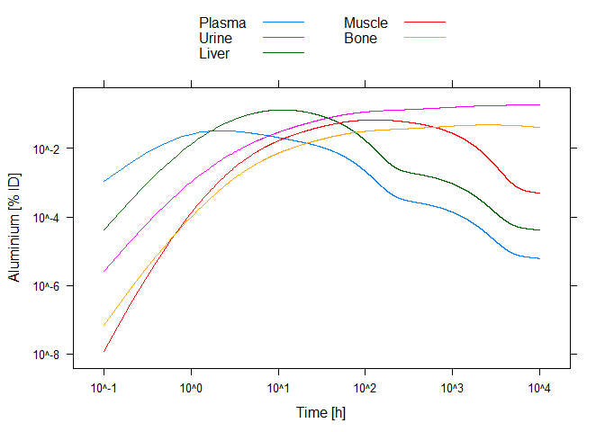
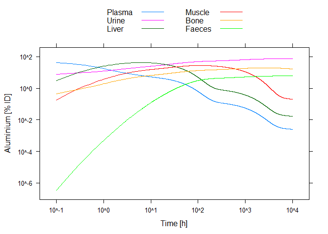
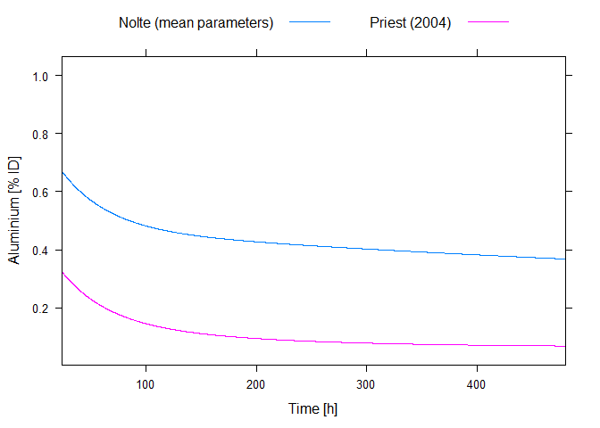
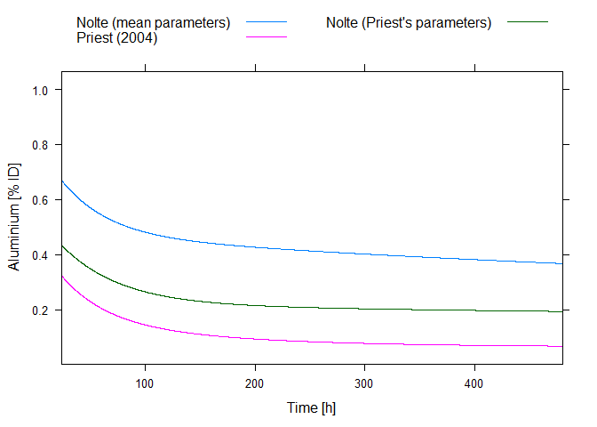

NolteWeisser\_AluminiumKinetics
===============================

The compartmental model for aluminium kinetics in human body of Nolte et al \[1,2\], as reparameterized by Weisser et al \[3\], implemented under [mrgsolve](https://mrgsolve.github.io/) and [R](https://www.r-project.org/).

Remarks
-------

The model file contains the mean parameter set — as presented in the supplementary appendix of \[3\] — so this is used in calculations by default. However, it can be changed in R (without changing the model file) as this is only a specification for defaults, and can be overridden, see Examples.

I tried to double-check everything, but no guarantee of course. I welcome every suggestion or correction!

Examples
--------

Necessary libraries:

``` r
library( mrgsolve )
library( lattice )
```

We first load the model:

``` r
mod <- mread( "NolteWeisser" )
```

    ## Compiling NolteWeisser ... done.

### Reproducing retentions using the mean parameter set

Let's first simulate what happens for oral dosing, using the mean parameter set (replicating Figure 4b of the supplementary appendix of \[3\]):

``` r
e <- ev( time = 0, evid = 1, amt = 1, cmt = "STO" )
out <- mrgsim( ev( mod, e ), end = 10000, delta = 0.1 )

xyplot( PLASMA*100 + U*100 + LIV*100 + MUS*100 + BON*100 ~ time, data = out@data[ -1, ], type = "l",
        scale = list( log = TRUE ),
        auto.key = list( text = c( "Plasma", "Urine", "Liver", "Muscle", "Bone" ),
                         lines = TRUE, points = FALSE, columns = 2 ),
        xlab = "Time [h]", ylab = "Aluminium [% ID]" )
```



Iv dosing, using the mean parameter set (replicating Figure 4a of the supplementary appendix of \[3\]):

``` r
e <- ev( time = 0, evid = 1, amt = 1, cmt = "PC" )
out <- mrgsim( ev( mod, e ), end = 10000, delta = 0.1 )

xyplot( PLASMA*100 + U*100 + LIV*100 + MUS*100 + BON*100 + FAE*100 ~ time, data = out@data[ -1, ],
        type = "l", scale = list( log = TRUE ),
        auto.key = list( text = c( "Plasma", "Urine", "Liver", "Muscle", "Bone", "Faeces" ),
                         lines = TRUE, points = FALSE, columns = 2 ),
        xlab = "Time [h]", ylab = "Aluminium [% ID]" )
```



### Reproducing the retention function of Priest (2004) and updating the parameters

In his influential publication \[4\], Priest gave the following long-term (overall) retention function:
*R*<sub>*t*</sub> = 0.293*e*<sup>−0.595*t*</sup> + 0.114*e*<sup>−0.172*t*</sup> + 0.065*e*<sup>−0.000401*t*</sup>,
 where *t* ≥ 1 is measured in days. (Of note, two out of the three half-lives presented in the original paper after this retention function are erroneous due to minor numerical mistakes, as confirmed by Priest in personal communication (14-Mar-2013): the first should be 1.16 days instead of 1.4 and the second should be 4.03 days instead of 40.)

Let's confront it with the predictions from our model:

``` r
out <- mrgsim( ev( mod, e ), end = 20*24, delta = 0.1 )
out@data$RETPRIEST <- 0.293*exp( -0.595*out@data$time/24 ) + 0.114*exp( -0.172*out@data$time/24 ) +
  0.065*exp( -0.000401*out@data$time/24 )
xyplot( RETENTION + RETPRIEST ~ time, data = out@data[ -1, ], type = "l", xlab = "Time [h]",
        ylab = "Aluminium [% ID]", xlim = c( 24, 20*24 ),
        auto.key = list( text = c( "Nolte (mean parameters)", "Priest (2004)" ),
                         columns = 2, lines = TRUE, points = FALSE ) )
```



The difference is substantial, a major reason of which is the fact the Priest used a single subject. Luckily, the parameters estimated from this subject are available (column labelled 'Nolte' in Table 1 of the Appendix of \[3\]), so we can assess the model using these, instead of the mean values.

This will also demonstrate how to update the parameters within the analysis (i.e. with the model file left untouched):

``` r
modNolte <- param( mod, KPTPC = 0.9091, KPCPT = 14.29, KPCIC = 20.00, KICPC = 5.000, KICIT = 17.40,
                   KITIC = 3.636, KLIVIN = 0.6300, KLIVOUT = 0.0550, KMUSIN = 0.0417,
                   KMUSOUT = 1.117e-03, KBONIN = 0.3750, KBONOUT = 7.000e-05, KU = 7.143,
                   KTD = 0.01667, KSD = 4.000, KDR = 0.2500, KRS = 0.02778 )
outNolte <- mrgsim( ev( modNolte, e ), end = 20*24, delta = 0.1 )
out@data$RETNOLTE <- outNolte@data$RETENTION
xyplot( RETENTION + RETPRIEST + RETNOLTE ~ time, data = out@data[ -1, ], type = "l", xlab = "Time [h]",
        ylab = "Aluminium [% ID]", xlim = c( 24, 20*24 ),
        auto.key = list( text = c( "Nolte (mean parameters)", "Priest (2004)",
                                   "Nolte (Priest's parameters)" ),
                         columns = 2, lines = TRUE, points = FALSE ) )
```



Acknowledgement
===============

I really appreciate the help of [Karin Weisser](http://www.pei.de/SharedDocs/Personen/DE/mitarbeiter/v-z/weisser-karin.html) for answering my questions that came up during this reimplementation of the model.

References
==========

1.  Nolte E, Beck E, Winklhofer C, Steinhausen C. Compartmental model for aluminium biokinetics. Hum Exp Toxicol. 2001 Feb;20(2):111-7.
2.  Steinhausen C, Kislinger G, Winklhofer C, Beck E, Hohl C, Nolte E, Ittel TH, Alvarez-Brückmann MJ. Investigation of the aluminium biokinetics in humans: a 26Al tracer study. Food Chem Toxicol. 2004 Mar;42(3):363-71.
3.  Weisser K, Stübler S, Matheis W, Huisinga W. Towards toxicokinetic modelling of aluminium exposure from adjuvants in medicinal products. Regul Toxicol Pharmacol. 2017 Aug;88:310-321.
4.  Priest ND. The biological behaviour and bioavailability of aluminium in man, with special reference to studies employing aluminium-26 as a tracer: review and study update. J Environ Monit. 2004 May;6(5):375-403.
